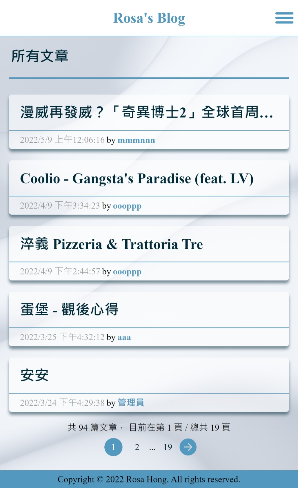
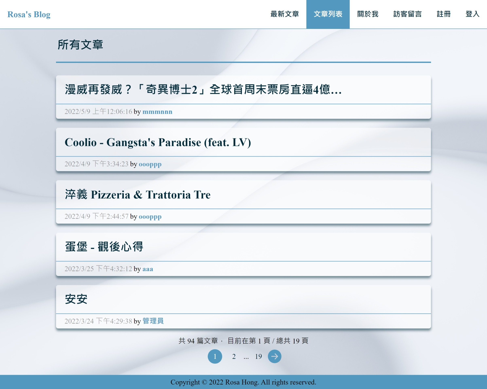

# 簡易 React SPA Blog

data 來自 [Lidemy 提供的 comments 與 posts API](https://github.com/Lidemy/lidemy-student-json-api-server)  
可以登入、註冊並發布文章與匿名留言

👉[DEMO](https://meitung473.github.io/React-SPA-Blog/)


## 核心功能
-   使用者可以進行**登入、註冊**，並且透過身分驗證才能對自己文章進行 CRUD
-   使用者可以未登入到留言板留言，對所有留言進行編輯與刪除
-   使用者登入後可以查看自己所有已發布的文章，可以對文章刪除或修改。
-   使用者可以在文章列表使用 **分頁瀏覽**
-   使用者可以在留言板使用卷軸滑動
-   支援 RWD 瀏覽

## DEMO
-   mobile

-   desktop


## 說明

**使用技術 :**

-   React Hooks
-   react-router-dom 提供的 HashRouter 建立路由
-   Redux/Redux toolkit
-   Redux thunk 串接 API
-   styled-components 以 JSX 語法撰寫 CSS 樣式
-   react-icon 套用 svg icon
-   react-spinners 套上 Loading 的效果
-   Prop-Types 型別檢查
-   ESLint、Prettier、Stylelint 套件檢查語法，統一 coding style 

**其他 :**

1. `usePageNavigation` - custom Hooks，實現分頁導覽列，顯示目前頁面前後各一頁與頭尾頁數。
2. `useloadMessage` -  custom Hooks，實現 Infinite scroll 載入資料。
3. `Compound Component` - React Design Pattern，在 Form 與 Post 元件使用複合式元件，提升元件的重複性與可擴充性。
4. styled-components Media Query - 透過 size array 搭配 reduce function 產生 breakpoints 物件，在 styled-components 使用 `$({theme})=>theme.media.md` 可以簡單使用對應的 media query。   


## 資料夾結構

```bash
|   contexts.js
|   index.js
|   statement.js
|   utiles.js
|   WebAPI.js
|
+---components
|   |   index.js
|   |
|   +---App
|   +---Button
|   +---Container
|   +---ErrorMessage
|   +---Footer
|   +---Form
|   +---Header
|   +---Loading
|   +---MessageBoard
|   +---PageNavigation
|   +---PageTitle
|   +---Post
|   \---Wrapper
+---constants
|       deviceMediaqury.js
|       globalStyle.js
|       index.js
|       theme.js
+---Hooks
|       usePageNavigation.js
|
+---pages
|   |   index.js
|   +---AboutPage
|   +---AddPostPage
|   +---EditPostPage
|   +---LoginPage
|   +---MessagePage
|   +---MyPostsPage
|   +---NewPostsPage
|   +---PostPage
|   +---PostsPage
|   \---RegisterPage
\---redux
    |   selector.js
    |   store.js
    \---reducers
            postReducer.js
            userReducer.js
```

## 參考資料

1. Compound Component - [Design Pattern In React — Compound component (複合元件)](https://oldmo860617.medium.com/design-pattern-in-react-component-compound-component-%E8%A4%87%E5%90%88%E5%85%83%E4%BB%B6-46ed5fb65459)
2. styled-components GlobalStyle - [使用 CreateGlobalStyle 在 React Styled-Components 取代 CSS Reset 與 CSS Normalize](https://medium.com/itsoktomakemistakes/%E4%BD%BF%E7%94%A8-createglobalstyle-%E5%9C%A8-react-styled-components-%E5%8F%96%E4%BB%A3-css-reset-%E8%88%87-css-normalize-fc8faa8059f1)
3. usePageNavigation 概念參考 : [導航元件 - Pagination](https://ithelp.ithome.com.tw/articles/10278297)
4. useloadMessage 無限滾動載入資料 : [React window 與 IntersectionObserver API 實現無限捲動 Dcard 文章閱讀器之心得紀錄](https://oldmo860617.medium.com/react-window-%E8%88%87-intersectionobserver-api-%E5%AF%A6%E7%8F%BE%E7%84%A1%E9%99%90%E6%8D%B2%E5%8B%95-dcard-%E6%96%87%E7%AB%A0%E9%96%B1%E8%AE%80%E5%99%A8%E4%B9%8B%E5%BF%83%E5%BE%97%E7%B4%80%E9%8C%84-97bc1c3faa07)


